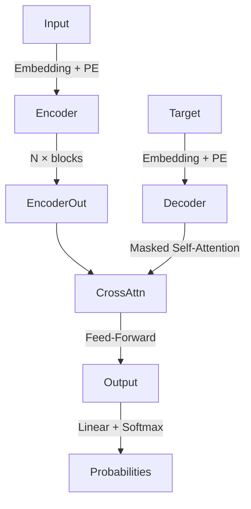

## Overview

[Placeholder — write your paper summary here.]

---

## Background and Motivation

[Placeholder — explain RNNs, their limitations, and why attention matters.]

---

## The Attention Mechanism

The core operation in the Transformer is **scaled dot-product attention**.
Given queries $Q$, keys $K$, and values $V$:

$$
\text{Attention}(Q, K, V) = \text{softmax}\left(\frac{QK^\top}{\sqrt{d_k}}\right) V
$$

The $\sqrt{d_k}$ scaling prevents the dot products from growing too large in magnitude,
which would push the softmax into regions with tiny gradients.

### Interactive: Attention Heatmap

Below is an attention weight matrix for a short example sentence.
Each row represents a query token attending over all key tokens.

```component
AttentionVisualizer
```

[Placeholder — explain what the reader should notice in the visualization.]

---

## Multi-Head Attention

Instead of a single attention function, the paper uses $h$ parallel attention heads:

$$
\text{MultiHead}(Q, K, V) = \text{Concat}(\text{head}_1, \ldots, \text{head}_h)\, W^O
$$

where $\text{head}_i = \text{Attention}(QW_i^Q, KW_i^K, VW_i^V)$.

---

## Positional Encoding

Because attention is permutation-invariant, position information is added explicitly:

$$
\text{PE}_{(pos, 2i)} = \sin\!\left(\frac{pos}{10000^{2i/d_{\text{model}}}}\right)
$$

$$
\text{PE}_{(pos, 2i+1)} = \cos\!\left(\frac{pos}{10000^{2i/d_{\text{model}}}}\right)
$$

---

## Architecture Diagram



---

## Code: Scaled Dot-Product Attention

```python
import torch
import torch.nn.functional as F
import math

def scaled_dot_product_attention(Q, K, V, mask=None):
    """
    Args:
        Q: (batch, heads, seq_q, d_k)
        K: (batch, heads, seq_k, d_k)
        V: (batch, heads, seq_k, d_v)
    Returns:
        output: (batch, heads, seq_q, d_v)
        weights: (batch, heads, seq_q, seq_k)
    """
    d_k = Q.size(-1)
    scores = torch.matmul(Q, K.transpose(-2, -1)) / math.sqrt(d_k)

    if mask is not None:
        scores = scores.masked_fill(mask == 0, float('-inf'))

    weights = F.softmax(scores, dim=-1)
    output = torch.matmul(weights, V)
    return output, weights
```

---

## Key Takeaways

[Placeholder — summarize the 3–5 most important ideas from the paper.]

---

## Further Reading

- [Placeholder link 1]
- [Placeholder link 2]
